# Active Directory Home Lab using Oracle Virtualbox

## Objectives
- Deploy a Windows Server virtual machine.
- Configure Active Directory Domain Services (AD DS).
- Create a new Windows domain.
- Join two Windows users to the domain.
- Verify communication between domain members.

## Executive Summary
The creation of an Active directory server with the setup of a domain controller (Windows Server) and two windows clients. The purpose of the lab is to build a rudimentary windows domain and develop foundational skills in Active Directory configuration and administration.

# Active Directory Home Lab — Domain Setup, OUs, Security Groups & Group Policy

A hands-on home lab where I built a Windows Server Active Directory environment from scratch: promoted a domain controller, designed an OU structure for a multi-region company, created and scoped security groups, configured Group Policy Objects, and joined a Windows 11 client to the domain.

**Guided by:** [East Charmer](https://www.youtube.com/watch?v=GsmJowwIh8Q) (YouTube)

## Lab Environment

| Component | Detail |
|---|---|
| Hypervisor | VirtualBox |
| Domain Controller | Windows Server 2022 |
| Client | Windows 11 Enterprise |
| Domain | `Ryan.local` |

## Objective

Set up an AD domain from scratch:
1. Install Windows Server in a virtual machine
2. Promote the server to a Domain Controller (DC)
3. Create an AD domain
4. Create organizational units (OUs) for different departments/regions
5. Create user accounts and groups within those OUs
6. Build an separate virtual machine

---

## Part 1 — Building the Domain Controller

**1. Downloaded the Windows Server 2022 ISO** and created a new virtual machine with it. On first login, Server Manager opened automatically.

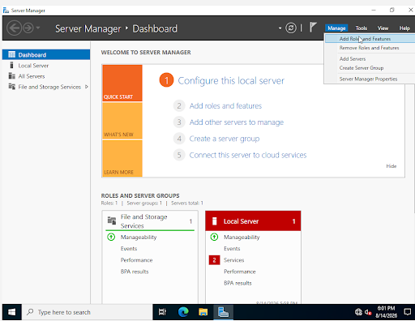

**2. Installed the Active Directory Domain Services role**, plus Remote Access (added for future lab projects).

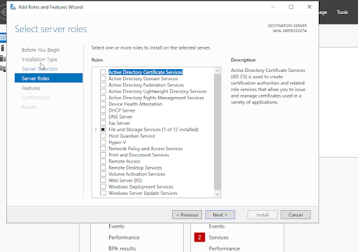

**3. Ran the Add Roles and Features Wizard**, then used the post-install notification to promote the server to a domain controller.

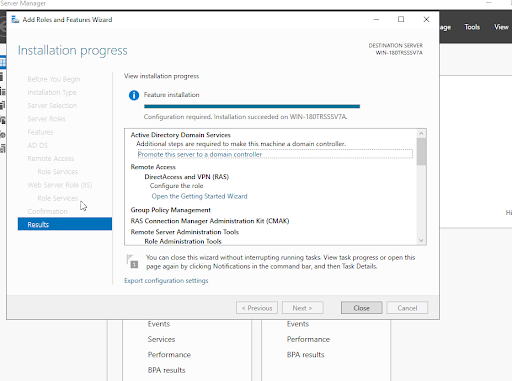

**4. Created a new forest** to house the domain and its organizational units, naming the root domain `Ryan.local`.

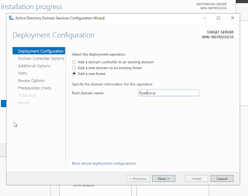

**5. Verified the install** via the Windows Administrative Tools menu, confirming Active Directory Users and Computers, Sites and Services, Domains and Trusts, etc. were all present.

---

## Part 2 — Organizational Unit (OU) Structure

Opened **Active Directory Users and Computers** to confirm the new `Ryan.local` domain, then began building out OUs.

Created new OUs from the right-click context menu:

**Result:** three top-level OUs — **USA**, **Germany**, and **Iceland** — each with its own **Server** and **Users** sub-OU, modeling a company with regional offices.

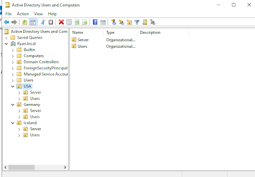

---

## Part 3 — Security Groups & Group Scope

Before creating groups, I researched into how AD group **scope** governs *membership* (who can be added) versus *usage* (where the group can be granted permissions).

| Scope | Membership | Usage |
|---|---|---|
| **Global** | Narrow — only accounts from the same domain | Wide — can be used forest-wide |
| **Domain Local** | Wide — accounts from any domain in the forest (or trusted domains) | Narrow — only on resources in its own domain |
| **Universal** | Wide — accounts from any domain in the forest | Wide — usable anywhere in the forest |

**Membership** = which accounts/computers/groups you're allowed to add as members — governed by *where those objects live*.
**Usage** = where you're allowed to place the group on a resource's ACL to grant permissions — governed by *where the resource lives*.

### The AGDLP model

The standard best-practice pattern for assigning permissions:

1. **A**ccounts → add user accounts to **G**lobal security groups based on role (e.g., *Marketing Team*, *Finance Department*)
2. **G**lobal groups → nest them inside **D**omain **L**ocal groups that represent specific resources (e.g., *Shared Drive Access*, *Payroll System*)
3. **D**omain Local → assign **P**ermissions to the domain local group 

### When Universal groups earn their place: AGUDLP

Universal groups solve the one case Global and Domain Local can't handle alone: needing **both** wide membership **and** wide usage. Example — building an "all IT staff, company-wide" group in a multi-domain forest:

1. Created a **Global** group in each domain (`USA\IT`, `Germany\IT`, `Iceland\IT`) — one per domain, since Global groups can't pull members across domains.
2. Nest all three Global groups inside one **Universal** group (`AllIT`) — legal because Universal groups accept members from any domain in the forest.
3. Nest that Universal group into **Domain Local** groups wherever the actual resources live, and assign permissions there.

This extends AGDLP into **AGUDLP**: Accounts → Global → Universal → Domain Local → Permissions. The Universal group is the "bridge" that combines multiple domains' Global groups into one unit. (This also comes up with mail-enabled/distribution groups — Exchange generally wants distribution groups to be Universal scope, since membership needs to be visible from every domain/site for mail routing.)

### Group types: Security vs. Distribution

- **Security groups** — assign user rights and permissions to shared resources (folders, printers, etc.). Includes built-in groups (e.g., *Domain Admins*, *Remote Desktop Users*) and custom groups (e.g., *Finance*, *HR*).
- **Distribution groups** — used to build email distribution lists (all employees, by department, or by role). Not used for permissions.

### Groups created

Built three Global security groups — **IT**, **HR**, and **Finance** — under the Users container.

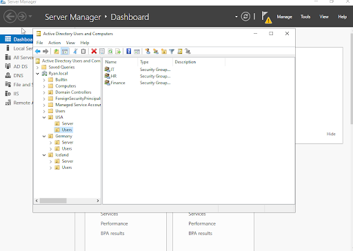

---

## Part 4 — Group Policy Management

Opened **Group Policy Management** to configure GPOs. Learned the two main settings:

- **Computer Configuration** — applies to the local machine regardless of who logs in 
- **User Configuration** — applies based on the logged-in user

 within each of those section there are further distinctions between:

- **Policies** — enforced, can't be changed by users (e.g., password policies, account lockout policies)
- **Preferences** — configured defaults users *can* change (e.g., mapped network drives, printers, desktop shortcuts)

### GPO 1 — Password Policy

Created a **Password Policy** GPO under Computer Configuration → Policies → Account Policies → Password Policy (all settings start as "Not Defined"):

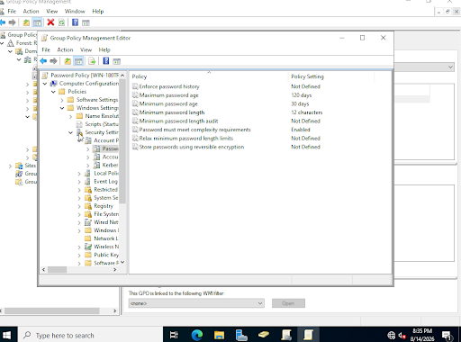

Configured it with:
- Maximum password age: **120 days**
- Minimum password age: **30 days**
- Minimum password length: **12 characters**
- Password must meet complexity requirements: **Enabled**

### GPO 2 — Drive Mapping

Configured a **Drive Maps** preference to map the `F:` drive to `\\FinanceServer\folder` for affected users.

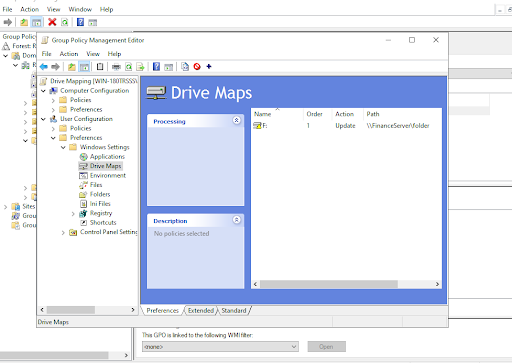

### GPO 3 — Restrict Control Panel Access

Enabled **"Prohibit access to Control Panel and PC settings"** under User Configuration → Administrative Templates → Control Panel, which removes Control Panel and PC settings access from the Start screen, File Explorer, Settings charm, and search results. This is very useful for user security especially if the new user could be a potential threat actor.

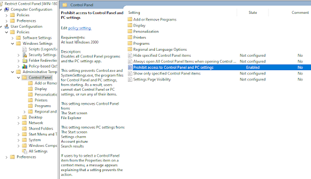

### GPO 4 — Disable USB Storage (practice)

For additional practice, enabled **"All Removable Storage classes: Deny all access"** to block USB flash drives and other removable storage. Helpful for preventing malware on USB drives.

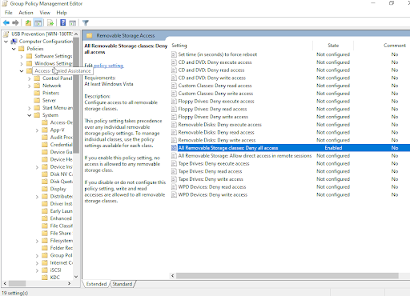

---

## Part 5 — Client Setup & Domain Join

1. Downloaded the **Windows 11 Enterprise** ISO and built a client VM.
2. On the **domain controller**, set a static IP address with an alternate DNS server of `8.8.8.8`.
3. On the **client**, set the network adapter's preferred DNS server to the domain controller's static IP.
   - *Why:* Active Directory relies on DNS to resolve and communicate with domain-joined clients — a static IP on the DC keeps that resolution consistent.
4. **Verified connectivity** by pinging the domain controller from the client:

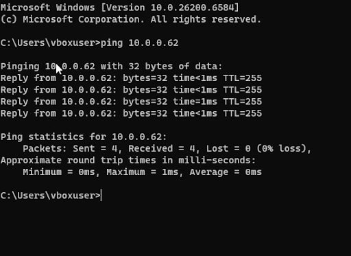

5. **Joined the client to the domain** via System Properties → Computer Name/Domain Changes, setting the domain to `Ryan.local` and the computer name  to Bob01.

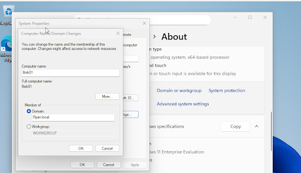

---

## Skills Demonstrated

- Installing and configuring Active Directory Domain Services on Windows Server
- Forest/domain creation and promotion of a domain controller
- Designing a multi-region OU structure
- AD group scope (Global / Domain Local / Universal) and the AGDLP / AGUDLP permission model
- Security vs. distribution groups
- Group Policy Object creation and management (password policy, drive mapping, Control Panel restriction, removable storage restriction)
- DNS configuration for AD name resolution and client connectivity troubleshooting (ping)
- Joining a Windows client to an AD domain

## Credit

Lab steps followed along with the [East Charmer](https://www.youtube.com/watch?v=GsmJowwIh8Q) YouTube tutorial.

## Troubleshooting

I ran into a **problem** while doing the lab. I wanted to add a specific wallpaper for the users. I went to the internet on the windows server virtual machine and I realized I couldn't use Microsoft Edge's search. 

### Possible Reasons for Connectivity Issues
- I set the virtual machines network incorrectly
- A preset firewall settings

After checking both of the options I realized it had nothing to do with the firewall or the VM network settings.

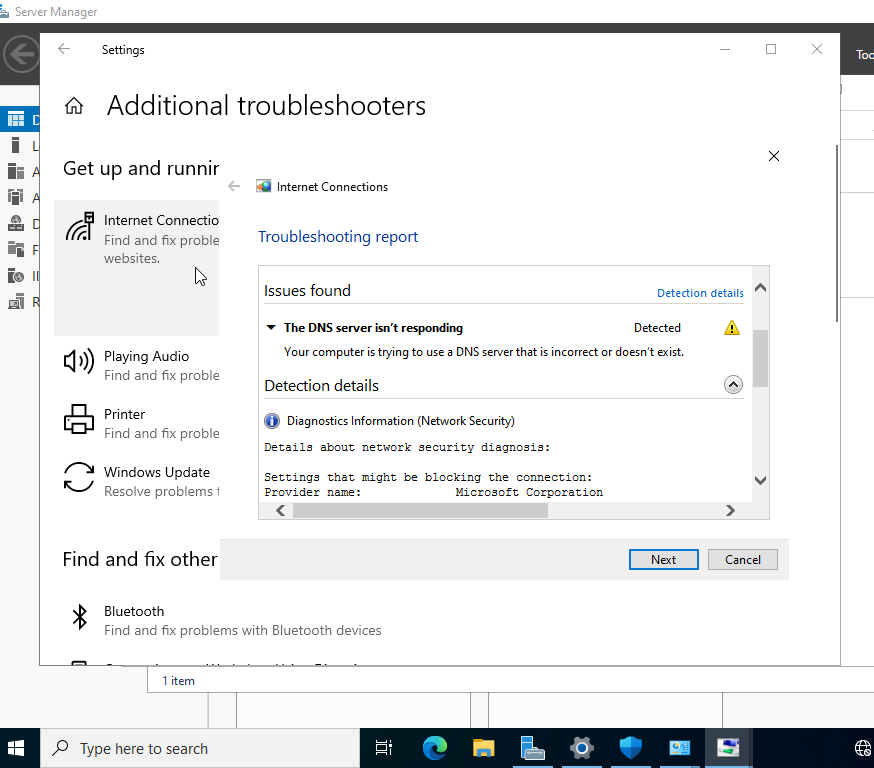

I ran the troubleshooter and discovered that it the issue had the do with the DNS server. Apparently Domain controller need a DNS resolver to be set up for the internet to discover unknown IP addresses. I had to go to DNS manager and add a port forwarder using google's 8.8.8.8 server to fix the issue. 

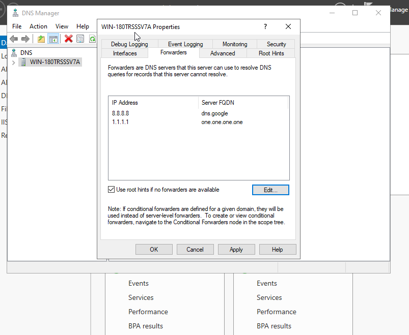
