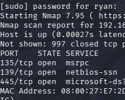

# Local Network Reconnaissance & Firewall Analysis Lab

## Executive Summary
This project demonstrates the execution of network reconnaissance techniques using Nmap within a isolated virtual environment I created on my PC with Oracle Virtualbox. The objective was to map a target host(Windows 11), analyze how local security policies (such as host-based firewalls) alter scanning results, and interpret Nmap output to identify active services and potential attack vectors.

## Environment & Tools
* **Hypervisor:** Oracle VirtualBox
* **Attacker Machine:** Kali Linux VM (IP: `192.168.192.3`)
* **Target Machine:** Windows 11 VM (IP: `192.168.192.4`)
* **Network Topology:** Isolated Host-Only Network (No external gateway, dedicated DHCP)

---

## Methodology & Execution

### 1. Lab Isolation & Baseline Connectivity
To ensure a safe testing environment, both virtual machines were placed on an isolated host-only network. 

Initial connectivity tests showed asymmetric behavior:
* The Windows 11 host could successfully ping the Kali Linux machine.
* The Kali Linux machine failed to ping the Windows 11 host due to default Windows Defender Firewall policies. It was specifically the policy about blocking ICMP packets by default.

**Remediation:** An inbound firewall rule was explicitly enabled on the Windows target to allow ICMPv4 Echo Requests, establishing a reliable baseline for testing.



### 2. Defensive Host Discovery (Firewall Enabled)
With the Windows Firewall active, an initial host discovery scan was performed using the `-sn` flag (ping scanning without port probing).

```bash
nmap -sn 192.168.192.0/24
